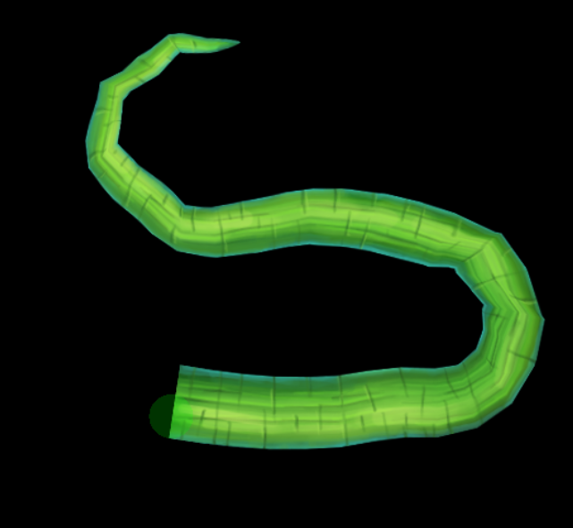

## Authors
---
* Alvaro Estrada - Technical Director

## Project preparation
To set up the project you need to have node.js installed and then run:

* npm install

Now you can run the project locally by using:

* npm run dev

This test consist of changing the path of the animation so the vine bends instead of going on a straight line, make sure of only modifying the path dynamically through code and do not modify the spine file. It should look like this:

## Expected result

